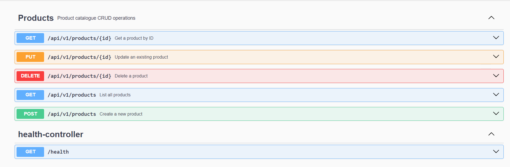

# product-service

[](https://github.com/kase2228/product-service/actions/workflows/ci.yml)

A RESTful product microservice built with Spring Boot 3.

## Getting Started

```bash 
mvn spring-boot:run 
``` 

## Endpoints

| Method | Path             | Description            | 
|--------|------------------|------------------------| 
| GET    | /products        | List all products      | 
| GET    | /products/{id}   | Get product by ID      | 
| POST   | /products        | Create a new product   | 
| GET    | /health          | Service health check   | 

---

## Extended API (v1)

The service has been extended with a versioned API and full CRUD support.

### 📡 Endpoints (v1)

| Method | Path                  | Description       |
| ------ | --------------------- | ----------------- |
| GET    | /api/v1/products      | Get all products  |
| GET    | /api/v1/products/{id} | Get product by ID |
| POST   | /api/v1/products      | Create product    |
| PUT    | /api/v1/products/{id} | Update product    |
| DELETE | /api/v1/products/{id} | Delete product    |

---

## API Documentation (Swagger)

Interactive API documentation is available via Swagger UI.

Open in your browser:

```
http://localhost:8080/swagger-ui.html
```

### Swagger UI Screenshot

The screenshot below confirms that all endpoints are correctly exposed:



---

## Testing

Run all tests:

```bash
mvn test
```

Expected:

* All tests pass
* CRUD operations verified
* Validation and error handling working

---

## Postman Collection

Location:

```
postman/product-service-lab2.json
```

Includes:

* CRUD requests
* Validation test (400 Bad Request)
* Not found test (404 Not Found)

---

## Additional Features

* DTO pattern (`ProductRequest`, `ProductResponse`)
* Input validation using `@Valid`
* Global exception handling
* Structured error responses using `ProblemDetail`
* H2 in-memory database
* OpenAPI integration

---


